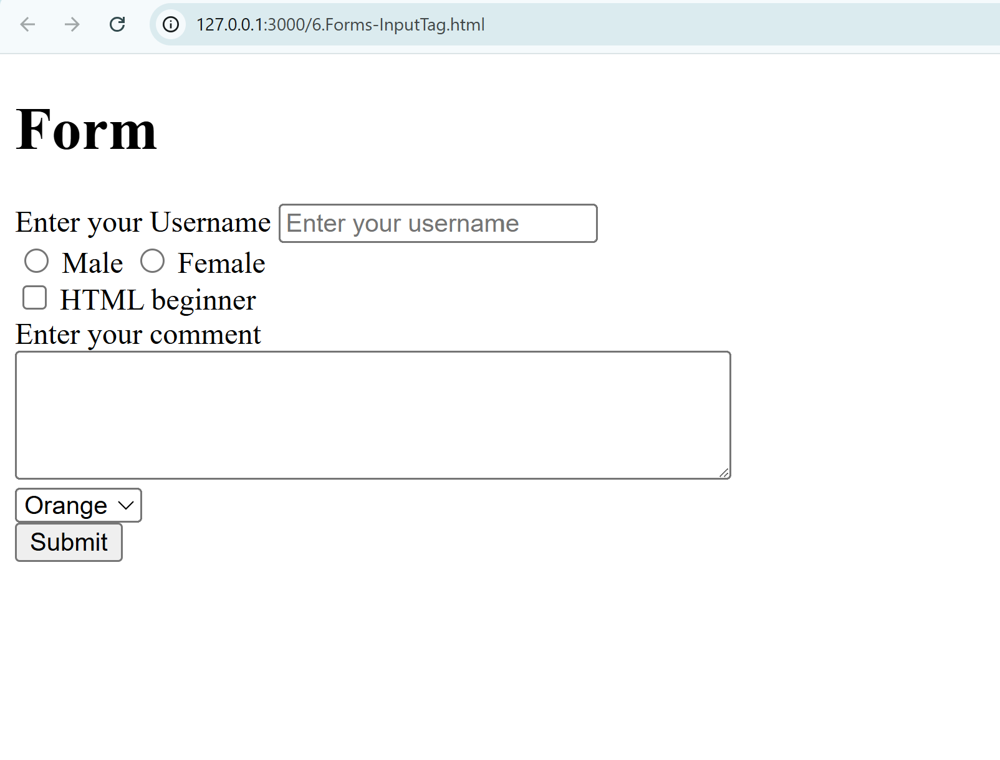
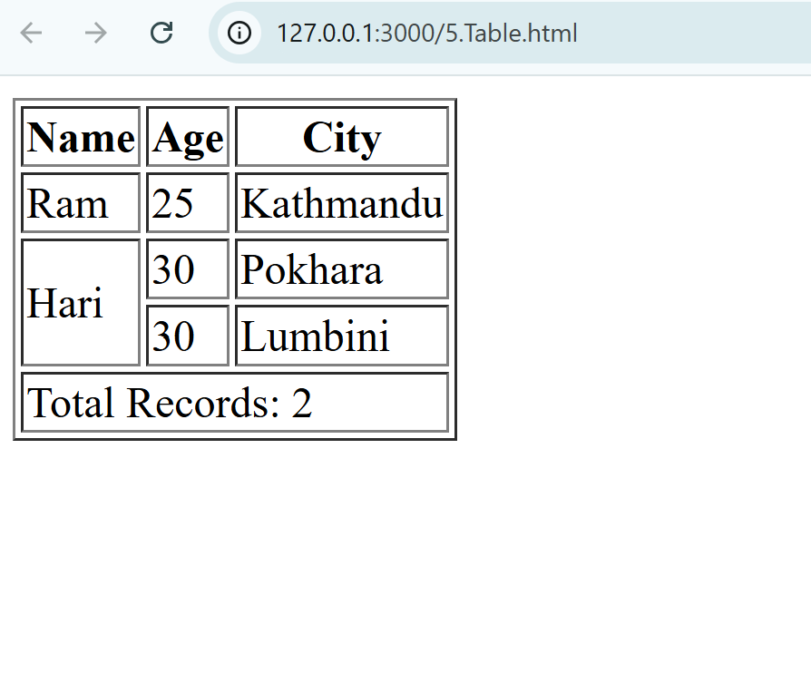

# 🌐 HTML Basics for Web Development

[](LICENSE)


Welcome to **HTML Basics for Web Development** – a beginner-friendly repository designed to help aspiring web developers learn and practice the foundational elements of HTML. This collection contains well-structured examples, explanations, and hands-on code that introduce the core building blocks of modern web pages.

---

## 📘 What This Repository Covers

This repository provides examples and explanations on the following key topics:

### ✅ HTML Fundamentals

- HTML structure (`<!DOCTYPE html>`, `<html>`, `<head>`, `<body>`)
- Elements & Tags
- Attributes and their usage
- Headings (`<h1>` to `<h6>`), paragraphs, and more

### ✅ Text Formatting Tags

- `<b>`, `<i>`, `<u>`, `<strong>`, `<em>`, `<mark>`, `<small>`

### ✅ Hyperlinks and Images

- Anchor tags (`<a>`)
- Image tags (``)
- Target and download attributes

### ✅ Lists and Tables

- Ordered & unordered lists
- Nested lists
- HTML tables with `<thead>`, `<tbody>`, `<tfoot>`

### ✅ Forms and Input Elements

- Input types: text, radio, checkbox, button
- Labeling inputs
- Submitting forms

### ✅ Semantic HTML

- Tags like `<section>`, `<article>`, `<aside>`, `<header>`, `<main>`, `<footer>`
- The role of semantic markup in accessibility and SEO

---

## 🖼️ Screenshots

| HTML Table Example                            | Form Input Example                          |
| --------------------------------------------- | ------------------------------------------- |
|  |  |

---

## 📁 Folder Structure

```bash
html-basics-for-webdev/
│
├── 01-basic-structure/
├── 02-text-formatting/
├── 03-links-and-images/
├── 04-lists-and-tables/
├── 05-forms/
├── 06-semantic-html/
├── assets/
└── README.md


# 🎯 Who Is This For?

This project is perfect for:

💻 Beginners learning front-end development

🏫 Students preparing for web development courses

📚 Anyone revisiting HTML fundamentals

🚀 Getting Started

To view the examples:

1. Clone the repository:

git clone https://github.com/Magartej/html-basics-for-webdev

2. Open any .html file in your browser or text editor to explore the content interactively.

🙌 Contributions

Contributions are welcome! If you'd like to:

. Fix bugs
. Improve examples
. Add more content

Feel free to fork the repo and submit a pull request.

📩 Contact

Created with 💙 by Tejendra Magar

🔗 LinkedIn

📬 Suggestions and feedback are always welcome!

📜 License

This project is licensed under the MIT License.

---
```
